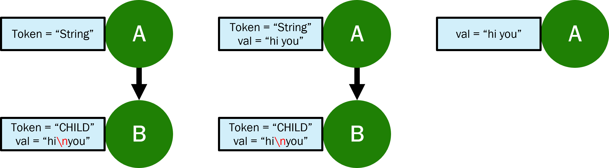

# Graph Rewrite
**Graph Rewrite** is a Python library for performing graph transformations using a declarative approach.

A detailed explanation of the library's motivation, structure and features - as well as some usage examples - can be found in an [overview presentation we've made](docs/graph_rewrite_overview.pptx).

## Motivation
The original motivation for our project derives from the domain of compiler development. During compilation, large internal graphs such as ASTs are constructed, and later modified (these graph modifications in context of compilers are called *passes*), thereby creating the need for a convinient tool to handle such graph transformations. 
Thus, our goal in developing the Graph Rewrite library is to allow a more intuitive handling of large patterns with more complex side effects (by using a declarative approach). 

## Installation
To download and install Graph Rewrite, run the following commands in your terminal:
```bash
# Install package given a conda environment with python>3.9
git clone https://github.com/DeanLight/graph_rewrite
cd graph_rewrite
pip install -e .

```

## Usage
The user interface includes a single function called ```rewrite```, by which graph transformations are made.
The user provides specifications for 3 NetworkX graphs: *LHS*, *P* and *RHS* (as elaborated [here](nbs/05_rules.ipynb#L27)), which together with some additional parameters specify the requested subgraphs to be found in the input graph and the transformation to be performed.

Examples:
- Find all vertices with two successors and remove the edges:
```python
# input_graph is a networkX directed graph.
matches = rewrite(input_graph,
        lhs='a->b; a->c', p='a;b;c', is_recursive=True)
```

- find all the pairs of parent-successor in which the parent has the 'val' attribute, increase it's value by 1, and place the result in the connecting egde. 
```python
matches = rewrite(input_graph,
        lhs='a[val]->b', p='a->b', rhs='a-[val={{new_val}}]->b', 
        render_rhs={'new_val': lambda match: match['a']['val'] + 1}, is_recursive=False)
```

We welcome you to view further [examples and use cases](nbs/06_transform.ipynb#L850), as well as the documentation of _rewrite_.
An elaborated specification of the three NetworkX patterns suppplied by the user can be found [in the _rules_ module](nbs/05_rules.ipynb#L596).

### Test Case
One of our goals when designing the library was ensuring that writing the transformations with our syntax is easier and more concise compared to other alternatives.

We can test it with the following extension of a RGXLog pass called "FixStrings". The original pass finds all appearances of string constants in the parse tree, and removes the line overflows escapes from the string. We extend it with the functionality of storing the fixed value in the parent, removing the "token" attribute from the parent and removing the child. Here's an example, with the leftmost graph being the pattern we search for, and the rightmost graph - the resulting graph after transformation:




Here are three possible implementations of this pass - In its original form in Spanner Workbench (which is simpler):
```python
class FixStrings(VisitorRecursivePass):
    def __init__(self, **kw: Any):
        super().__init__()

    @no_type_check
    @assert_expected_node_structure
    def string(self, string_node: LarkNode):
        cur_string_value = string_node.children[0]
        fixed_string_value = cur_string_value.replace('\\\n', '')
        string_node.children[0] = fixed_string_value
```

Its implementation with a popular graph transformation Python package called Regraph:
```python
# First pass: fix val attribute in child
lhs = NXGraph()
lhs.add_nodes_from([
    ('A', {'token': 'String'}),
    ('B', {'token': 'CHILD'})
])
lhs.add_edges_from([('A', 'B')])
matches = input_g.find_matching(lhs)
for match in matches:
    if 'val' in input_g.get_node_attrs(match['B']):
        fixed_string = str(input_g.get_node(match['B'])['val']).replace('\\\n', '')
        old_A_node = input_g.get_node(match['A'])
        old_A_node['val'] = fixed_string

# Second pass: remove node B
rule = Rule.from_transform(lhs)
rule.inject_remove_node('B')
rule.inject_remove_node_attrs('A', {'token': 'String'})
matches = input_g.find_matching(lhs)
for match in matches:
    if 'val' in input_g.get_node_attrs(match['B']):
        input_g.rewrite(rule, match)
```

And finally, the implementation in our new syntax:
```python
rewrite(
    input_graph,
    lhs = 'a[token="String"]->b[token="CHILD", val]',
    p = 'a',
    rhs = 'a[val={{new_string}}]',
    condition = lambda match: '\\\n' in match['b']['val'],
    render_rhs = {'new_string': lambda match: match['b']['val'].replace('\\\n', '')}
)
```

One can see that the latter implementation is short and concise compared to the others, and that it does the whole transformation in a single pass rather than in two. It also filters irrelavant matches along the way using the ```condition``` parameter, which improves performance, and saves imperative calculations for each match separately by using the ```render_rhs``` parameter, that specifies the correct RHS for each match.
## Resources
- [ReGraph](https://github.com/Kappa-Dev/ReGraph) library (allows graph transformations using an imperative interface)

- Following the motivation section above, as a part of our integration tests we implemented the internal-graph transformations (also called "passes") of the [SpannerWorkbench](https://github.com/DeanLight/spanner_workbench) interpreter.

- [lark library documentation](https://lark-parser.readthedocs.io/en/latest/json_tutorial.html) - used in our modules and in the Spanner Workbench passes we implement.
